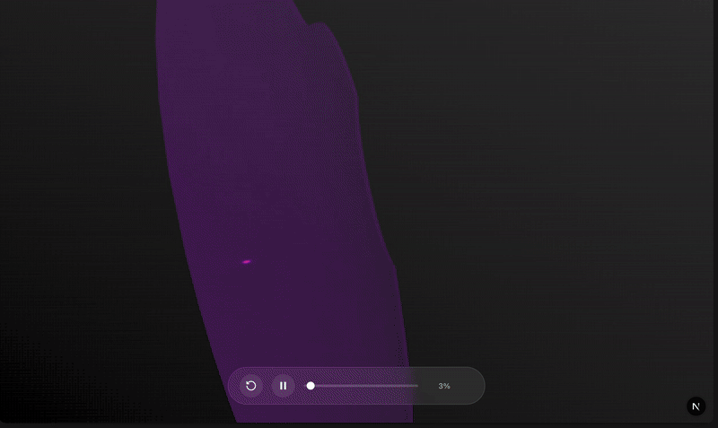

# Apple TV Intro Animation

Apple TV’s new intro looks simple, right?
A logo. A glow. A collapse.

What made it even more interesting to me?

The original commercial was created entirely without computer graphics 🤯

So, I tried to recreate the same illusion entirely in CG using React Three Fiber and Next.js, not to copy Apple, but to understand how motion, geometry, and light work together when realism is not handed to you.

I wrote up the full breakdown below, and it also happens to be my first Medium article. 😊

https://lnkd.in/eseTU6-D



## Tech Stack

- [Next.js](https://nextjs.org) - React framework
- [React Three Fiber](https://docs.pmnd.rs/react-three-fiber) - React renderer for Three.js
- [Three.js](https://threejs.org) - 3D graphics library
- [Tailwind CSS](https://tailwindcss.com) - Styling

## Getting Started

### Prerequisites

- Node.js 18+
- npm, yarn, pnpm, or bun

### Installation

1. Clone the repository:
```bash
git clone https://github.com/Drewskee/r3f-apple-intro.git
cd r3f-apple-intro
```

2. Install dependencies:
```bash
npm install
# or
yarn install
# or
pnpm install
```

3. Run the development server:
```bash
npm run dev
# or
yarn dev
# or
pnpm dev
```

4. Open [http://localhost:3000](http://localhost:3000) in your browser to see the animation.

## Scripts

- `npm run dev` - Start development server
- `npm run build` - Build for production
- `npm run start` - Start production server
- `npm run lint` - Run ESLint

## License

MIT
